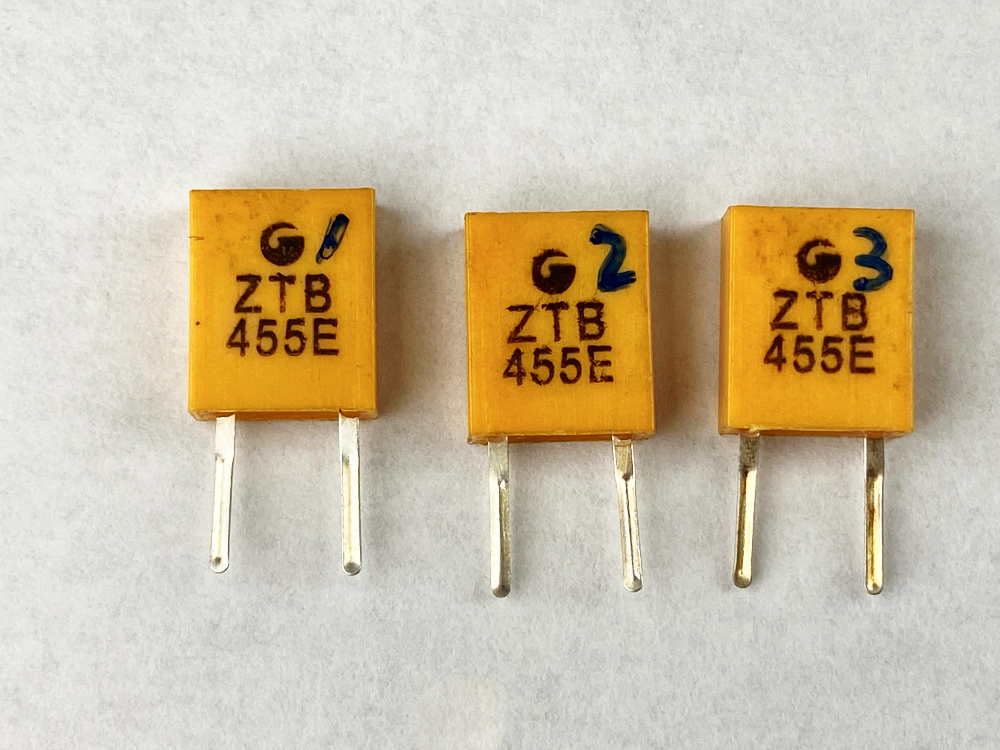

# ZTB455E Ceramic Filter 2Pin

## Sammary (JPN: 概要)

JPN: 3つのZTB455EをNanoVNA VAA2 で計測した。

### CH0-DUT-CH1 (JPN: 透過特性)

JPN:S21 Gainがピークになる周波数

|DUT No(JPN:テスト対象物)|Frequency| S21 Gain(dB) | 
----|----|----
|1 |439.960kHz| -1.651|
|2 |437.700kHz| -0.787|
|3 |434.480kHz| -0.605|

### CH0-DUT-GND

JPN:S11|Z| が最低になる周波数

|No|Frequency|
----|----
|1 |440.140kHz| 
|2 |437.740kHz| 
|3 |434.460kHz| 

|Test Item| Description|
----|----
|NanoVNA| NanoVNA SAA2|

## Schematic (JPN: 回路図)

## Screen Shot

## etc
