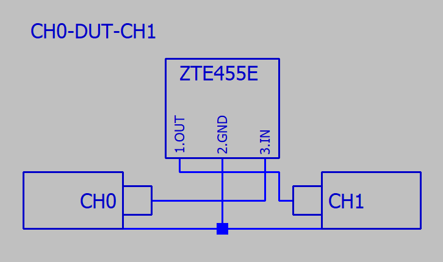
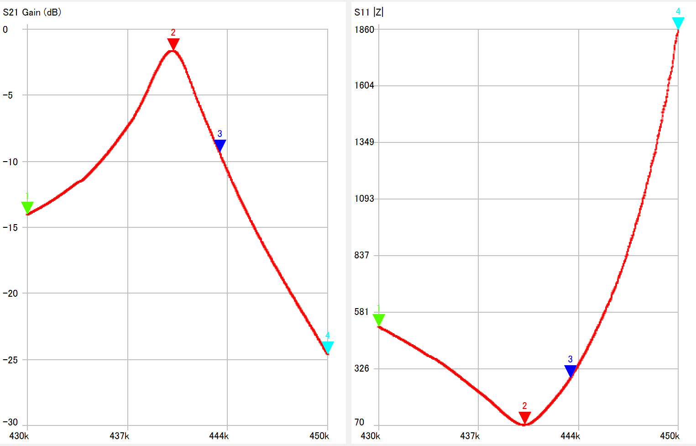
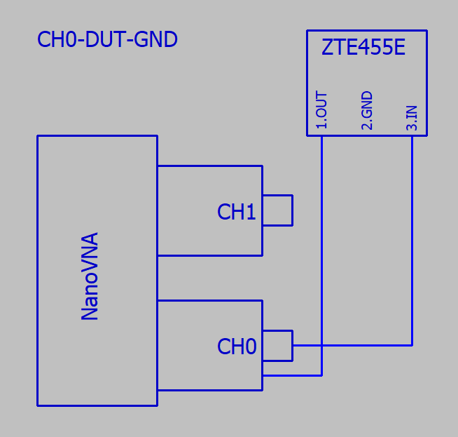
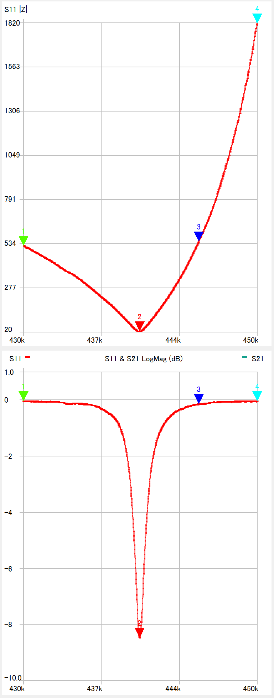
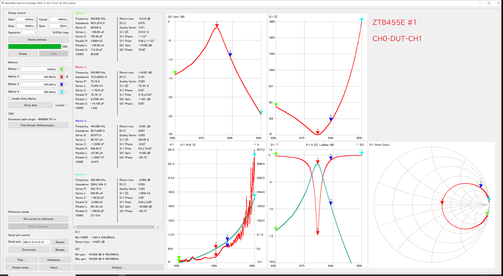
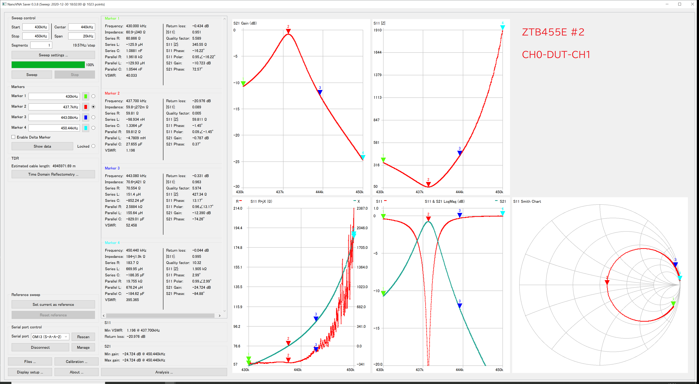
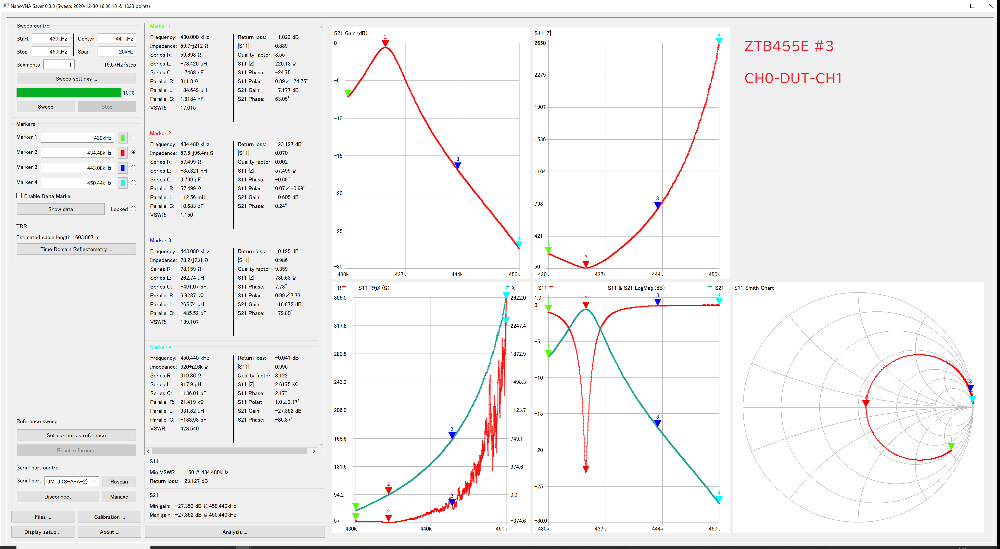
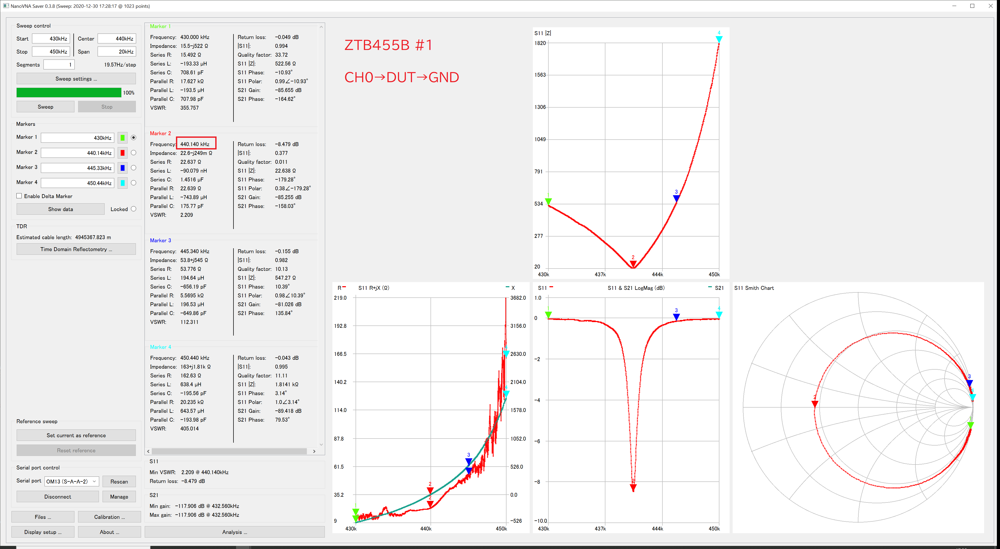
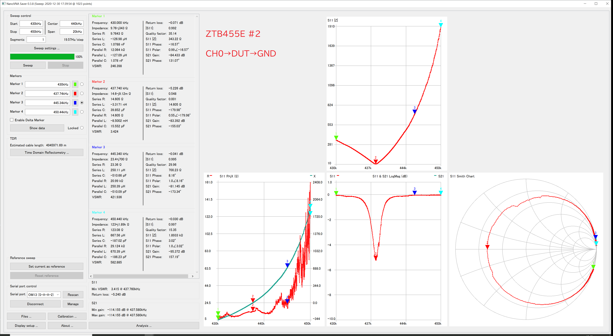
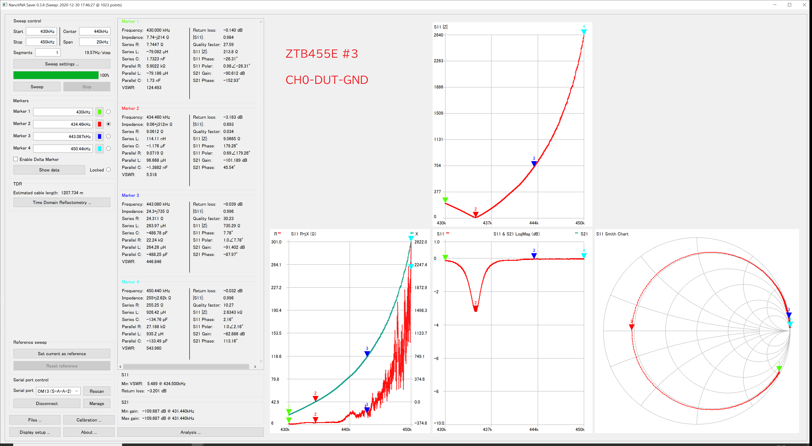

# ZTB455E Ceramic Filter 2Pin

## Sammary (JPN: 概要)

JPN: AliExpressで購入したセラミックフィルターをNanoVNA VAA2 で計測した。

|DUT (JPN:テスト部品)|Description|リンク|
----|----|----
|ZTB455E |445kHz ceramic filter|[AliExpressの商品ページ](https://bit.ly/3pC7Pw4) (CRB445E になっている)|

### 注意

・インピーダンス不整合で計測しているので、結果は参考程度の値です。

|部品|インピーダンス|
----|----
|ZTB455E |3kΩ(同様のMurata社セラミックフィルターから推定）| 
|NanoVNA |50Ω|

### CH0-DUT-CH1 (JPN: 透過特性)

#### Schematic (JPN: 回路図)

#### 結果

JPN:S21 Gainグラフ、S11|Z|グラフ

JPN:S21 Gainがピークになる周波数(▼2)

|DUT(JPN:テスト対象物)|Frequency| S21 Gain(dB) | 
----|----|----
|1 |439.960kHz| -1.651|
|2 |437.700kHz| -0.787|
|3 |434.480kHz| -0.605|

### CH0-DUT-GND

#### Schematic (JPN: 回路図)

#### 結果

JPN:S11|Z|グラフ、S11 LogMag

JPN:S11|Z| が最低になる周波数(▼2)

|DUT(JPN:テスト対象物)|Frequency|
----|----
|1 |440.140kHz| 
|2 |437.740kHz| 
|3 |434.460kHz| 

|Test Item| Description|
----|----
|NanoVNA| NanoVNA SAA2|

## Screen Shot

