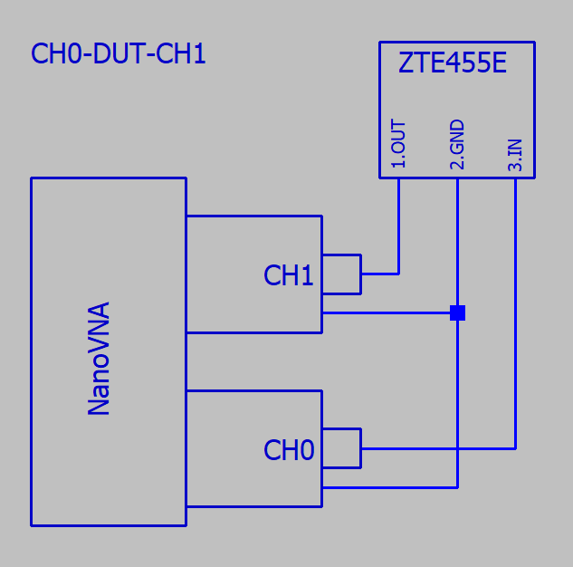

# ZTB455E Ceramic Filter 2Pin

## Sammary (JPN: 概要)

JPN: AliExpressで購入したセラミックフィルターをNanoVNA VAA2 で計測した。

|DUT |Description|リンク|
----|----|----
|ZTB455E |445kHz ceramic filter|[AliExpressの商品ページ](https://bit.ly/3pC7Pw4) (このページでは表記がCRB445E になっている)|

DUT: Device Under Test (JPN:DUTはテスト対象物)

### 注意

・インピーダンス不整合で計測しているので、結果は参考程度の値です。

|部品|インピーダンス|
----|----
|ZTB455E |3kΩ(同様のMurata社セラミックフィルターから推定）| 
|NanoVNA |50Ω|

---

### CH0-DUT-CH1 (JPN: 透過特性)

#### Schematic (JPN: 回路図)

#### 結果

JPN:S21 Gainグラフ、S11|Z|グラフ

JPN:S21 Gainがピークになる周波数(▼2)

|DUT |Frequency| S21 Gain(dB) | Screen Shot|
----|----|----|----
|1 |439.960kHz| -1.651|  |
|2 |437.700kHz| -0.787|  |
|3 |434.480kHz| -0.605|  |

<!--
##### 注意

S21 Gain = DUTの減衰値 __ではない__ ことに注意。
-->

---

### CH0-DUT-GND

#### Schematic (JPN: 回路図)

#### 結果

JPN:S11|Z|グラフ、S11 LogMag

JPN:S11|Z| が最低になる周波数(▼2)

|DUT(JPN:テスト対象物)|Frequency|S11｜Z｜ (Ω)| Screen Shot|
----|----|----|----
|1 |440.140kHz| 22.638|  |
|2 |437.740kHz| 14.605|  |
|3 |434.460kHz| 9.0665|  |

<!--

##### 注意

S11|Z| = DUTの抵抗値 __ではない__ ことに注意。

-->

---

## Etc

|Item | Description| Link|
----|----|----
|NanoVNA| NanoVNA V2_2 (SAA2) <!-- Version git-20201122 --> | https://nanorfe.com/nanovna-v2.html |
|PC Application| NanoVNASaver 0.3.8 | https://github.com/NanoVNA-Saver/nanovna-saver |

